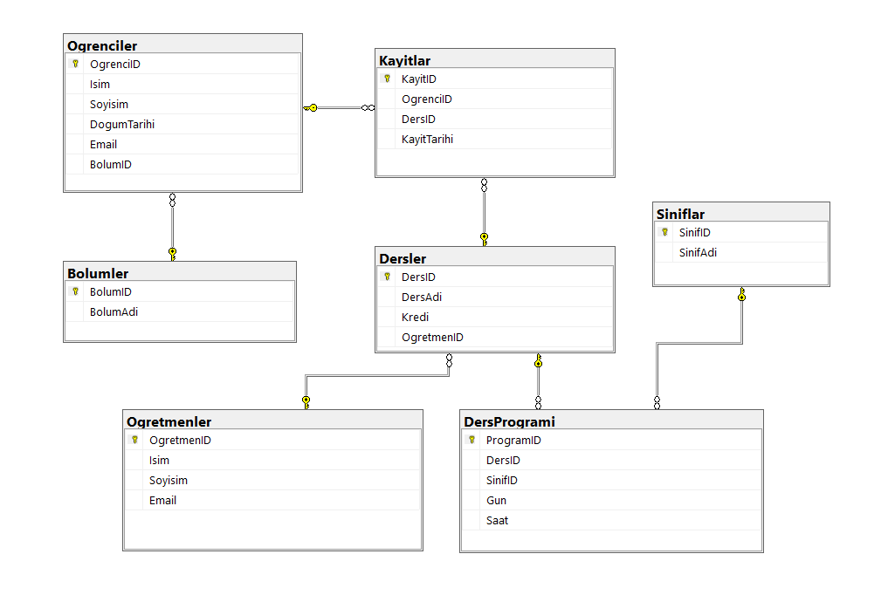

# ogrenci-yonetim-sistemi

## Veritabanı Tasarımı ve Tabloların Bağlantıları

Bu proje, öğrenci yönetim sistemi için veritabanı tasarımı ve SQL sorgularını içermektedir. Aşağıda, veritabanında kullanılan tablolar ve bunların birbirleriyle olan ilişkilerini gösteren bir diyagram bulunmaktadır.

### Tablolar:

1. **Ogrenciler**: Öğrencilerin temel bilgilerini içerir.

   - **Primary Key**: `OgrenciID`

2. **Bolumler**: Bölümlerin bilgilerini içerir.

   - **Primary Key**: `BolumID`

3. **Kayıtlar**: Öğrencilerin ders kayıt bilgilerini içerir.

   - **Primary Key**: `KayitID`
   - **Foreign Keys**: `OgrenciID`, `DersID`

4. **Dersler**: Derslerin bilgilerini içerir.

   - **Primary Key**: `DersID`
   - **Foreign Key**: `OgretmenID`

5. **Ogretmenler**: Öğretmenlerin bilgilerini içerir.

   - **Primary Key**: `OgretmenID`

6. **Siniflar**: Sınıfların bilgilerini içerir.

   - **Primary Key**: `SinifID`

7. **DersProgrami**: Derslerin program bilgilerini içerir.
   - **Primary Key**: `ProgramID`
   - **Foreign Keys**: `DersID`, `SinifID`

### İlişkiler:

- **Ogrenciler** ve **Kayıtlar**: `OgrenciID` ile ilişkili. (1-N)
- **Dersler** ve **Kayıtlar**: `DersID` ile ilişkili. (1-N)
- **Dersler** ve **Ogretmenler**: `OgretmenID` ile ilişkili. (N-1)
- **Bolumler** ve **Ogrenciler**: `BolumID` ile ilişkili. (1-N)
- **Dersler** ve **DersProgrami**: `DersID` ile ilişkili. (1-N)
- **Siniflar** ve **DersProgrami**: `SinifID` ile ilişkili. (1-N)

Bu diyagram, veritabanı yapısını ve tablolar arasındaki ilişkileri görsel olarak sunar.

